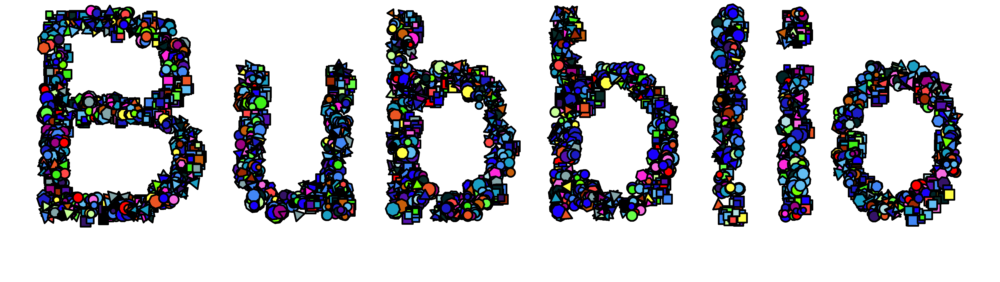
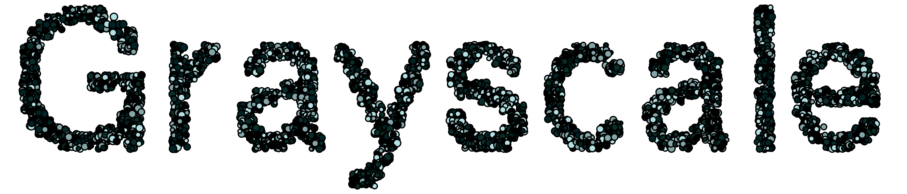

<p align="center">
    
</p>

# Bubblio

Bubblio is a script that produces scatter-plot style letters in various fonts, colors and densities.

## Usage

```
go run *.go text sep output
```

### Positional Arguments

There are three positional arguments for Bubblio:

Argument | Description | Example
--- | --- | ---
`text` | The text you'd like to bubblify | `Bubblio`
`sep` | If you'd like to bubblify multiple words and have them be on separate lines, **sep** specifies how they should be split | If `text` is `Hello::World`, then `sep` would be `::` to place `Hello` and `World` on separate lines.
`output` | The output file name with file extension | `Bubblio.png`.

### Optional Arguments

```
  -animate
        Create animated GIF with letters.
  -color string
        Color palette for letters (default "blue").
        One of "blue", "yellow", "red", or "purple".
  -font string
        Font to write letters in. (default "helvetica").
        One of "sapphire", "courier", "emerald", "helvetica", "athens", "geneva", "la", or "times".
  -frames int
        Number of frames in animated GIF (default 10).
  -img
        Include PNG images if true (for use with -animate).
  -o string
        Orienation. [L]eft, [R]ight, or [C]entered (default "L").
  -scale int
        Relative size of components (default 50).
  -shape string
        Component shapes of letters (default "circle").
        One of "random", "circle", "square", "polygon", or "triangle".
  -sides int
        Number of sides for the Polygon. (default 5).
```

## Documentation

### Shapes

Bubblio offers four different shapes to draw letters in:

Circle | Square | Triangle
--- | --- | ---
 |  | 
Polygon | Random |
 | 

### Fonts

Bubblio offers several different fonts.

Font | Visual
--- | ---
Sapphire | 
Courier | 
Emerald | 
Helvetica | 
Athens | 
Geneva | 
LA | 
Times | 

### Colors

The five different color options available are:

Yellow | Red
--- | ---
 | 
Purple | Blue
 | 
Grayscale |



## Acknowledgements

The bitmaps provided in the **Fonts** folder came from GitHub user [Rob Hagemans'](https://github.com/robhagemans) repository [Hoard of Bitfonts](https://github.com/robhagemans/hoard-of-bitfonts). Specifically, the font file names used were

* **Sapphire:** `amiga-wb10-sapphire-19.yaff`
* **Courier:** `amiga-wb31-courier-24.yaff`
* **Emerald:** `amiga-wb31-emerald-20.yaff`
* **Helvetica:** `amiga-wb31-helvetica-24.yaff`
* **Athens:** `Athens_18.yaff`
* **Geneva:** `Geneva_24.yaff`
* **LA:** `Los_Angeles_24.yaff`
* **Times:** `Times_24.yaff`

The GIF creation code in `main.go` in function `CreateGIF` was inspired by GitHub user [Hirmou Ochiai's](https://github.com/otiai10) [GIFFY library on GitHub](https://github.com/otiai10/giffy).

Bubblio depends heavily on the [gg library](https://github.com/fogleman/gg) from [Michael Fogleman](https://github.com/fogleman) (and contributors) for the graphics.